<h1 align="center">
  
</h1>

<h5 align="center">
  <code><a href="https://www.linkedin.com/in/al%C3%A6-ameur-b52632363" title="LinkedIn Profile">LinkedIn</a></code>
  <code><a href="https://github.com/Alaa359" title="GitHub Profile">GitHub</a></code>
  <code><a href="mailto:alaameur33@gmail.com" title="Email">Email</a></code>
</h5>

 

  Hi, I'm Ala Ameur, Web Developer from Tunisia
   
   
  🚀 I'm a passionate web developer who loves building modern and user-friendly websites
   
  🔭 I'm currently working on web development projects
   
  🌱 I'm currently learning new technologies and improving my skills
   
  💻 I love writing clean, efficient code and learning new things about it
   
  🤝 I'm always open to collaborating on interesting projects
   
  💬 Ask me anything about web development
   
  📫 How to reach me: <a href="mailto:alaameur33@gmail.com">alaameur33@gmail.com</a>

<h2 align="center">🔥 Languages & Frameworks & Tools & Abilities 🔥</h2>
 

  <code></code>
  <code></code>
  <code></code>
  <code></code>
  <code>💡 Problem Solving</code>
  <code></code>
  <code></code>
  <code></code>
  <code></code>
  <code></code>
  <code></code>
  <code></code>
  <code></code>
  <code></code>
  <code></code>
  <code></code>
  <code></code>
  <code></code>
  <code></code>
  <code></code>
  <code></code>

<h2 align="center">🚀 About Me 🚀</h2>
 

  👋 I'm Ala Ameur, a passionate and dedicated web developer based in Tunisia.
   
  I enjoy creating clean, responsive and user-friendly web applications
   
  that solve real-world problems. My goal is to keep learning, growing
   
  and building projects that make a difference.

<h2 align="center">🏆 GitHub Trophies 🏆</h2>
 

  

<h2 align="center">⚡ Stats ⚡</h2>
 

  

    
    
  

           
  

    
  

<h4 align="center">
  <a href="https://github.com/Alaa359?tab=repositories" title="Show Repositories">🔎 Show More 🔍</a>
</h4>